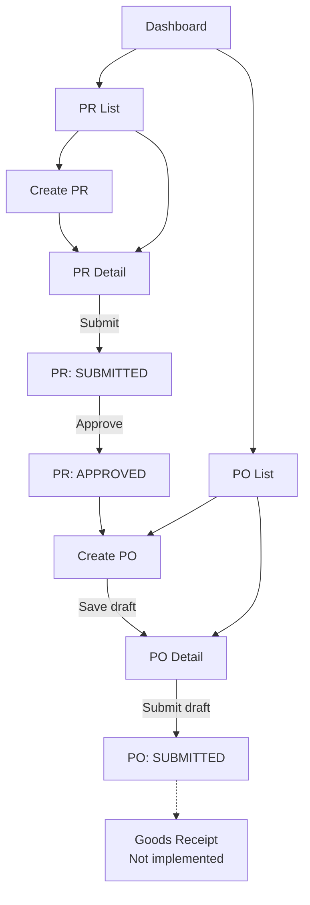
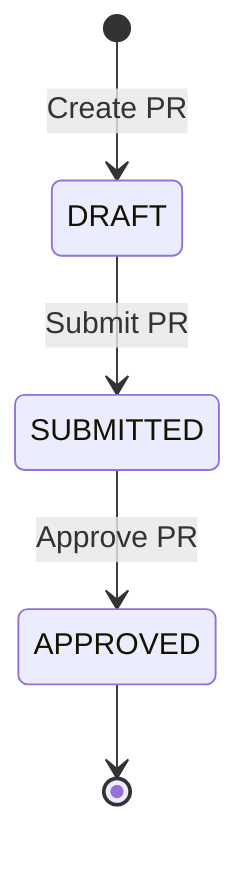
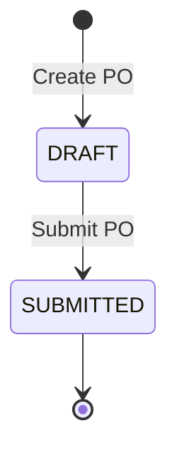
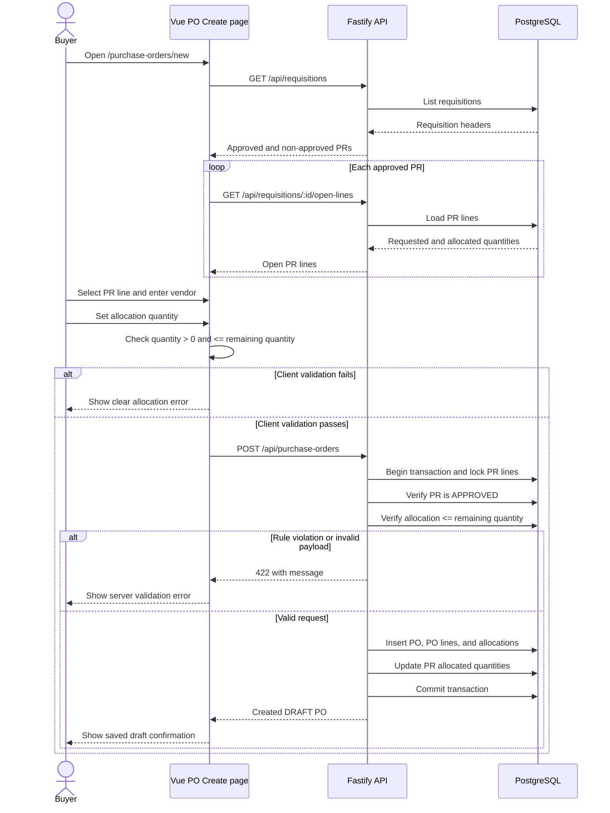
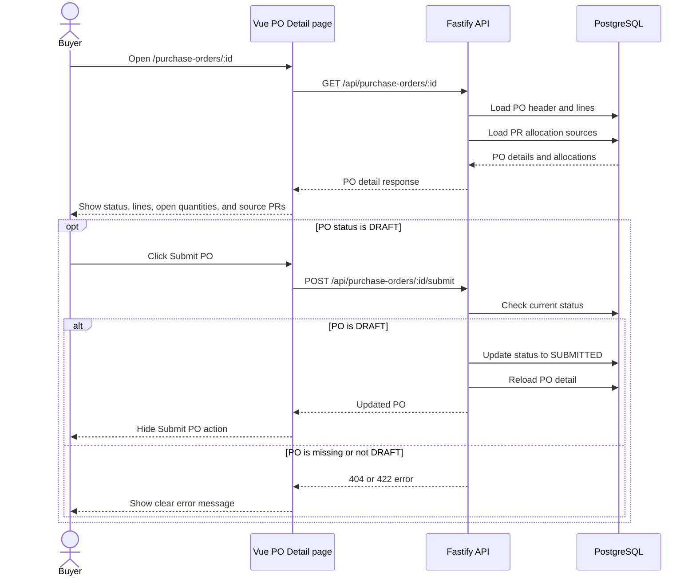

# Procurement MVP Application Guide

## Overview

This application is a small procurement management system built for the workshop. It supports the flow from Purchase Requisition (PR) to Purchase Order (PO). Goods Receipt (GR) tables exist in the database schema, but GR screens and APIs are not currently implemented.

The application has two runtime parts:

- **Frontend:** Vue 3 and Vite, served at `http://localhost:5173`.
- **Backend:** Fastify REST API, served at `http://localhost:3000`.
- **Database:** PostgreSQL running in Docker on port `5433`.

## User Flow

A requester creates a PR and submits it for approval. Once approved, a buyer can select its open lines while creating a PO. The buyer then saves and submits the PO.



## Frontend Pages

| Route | Purpose | Backend interaction |
| --- | --- | --- |
| `/` | Dashboard with PR summary information. | Loads requisitions through the frontend API client. |
| `/requisitions` | Lists purchase requisitions. | `GET /api/requisitions` |
| `/requisitions/new` | Creates a purchase requisition. | `POST /api/requisitions` |
| `/requisitions/:id` | Displays a PR and supports submit/approve actions. | `GET`, `POST .../submit`, and `POST .../approve` |
| `/purchase-orders` | Lists purchase orders and links to details. | `GET /api/purchase-orders` |
| `/purchase-orders/new` | Selects approved PR open lines and creates a PO draft. | PR list/open-lines APIs and `POST /api/purchase-orders` |
| `/purchase-orders/:id` | Displays PO header, lines, allocations, and draft submit action. | `GET` and `POST .../submit` |

The PO Create page is composed from the reusable `PurchaseOrderHeaderForm` and `LineAllocationTable` components. The header form emits vendor/date changes, while the table emits line selection, edits, and removal actions to the page.

## PR Lifecycle

PR status transitions are controlled by the backend service:



Only approved PR lines are available for PO allocation. For each PR line, the backend calculates:

`remaining quantity = requested quantity - allocated quantity`

## PO Lifecycle

A PO starts as `DRAFT` when it is created. It can be submitted once, changing its status to `SUBMITTED`.



## PO Create Sequence

The following sequence describes the current PO Create page behavior, including how approved PR lines are loaded and how the create request is validated.



## PO Detail And Submission Sequence



## PO API Contract

| Method | Endpoint | Result |
| --- | --- | --- |
| `GET` | `/api/purchase-orders` | Returns `{ items }` with PO headers ordered newest first. |
| `POST` | `/api/purchase-orders` | Creates a draft PO from approved PR lines. Returns `201` on success. |
| `GET` | `/api/purchase-orders/:id` | Returns the PO header, lines, and source PR allocations. |
| `POST` | `/api/purchase-orders/:id/submit` | Changes a draft PO to `SUBMITTED`. |
| `GET` | `/api/purchase-orders/:id/open-lines` | Returns PO lines with quantity still open for GR. |

### Error behavior

- `404` is returned when a requested PO does not exist.
- `422` is returned for invalid payloads, non-approved PR sources, over-allocation, or invalid status transitions.
- Over-allocation is rejected when `qtyOrdered` is greater than the PR line's remaining quantity.
- The backend performs the authoritative check inside a transaction after locking the referenced PR line.
- The frontend also checks the quantity before sending the request and renders backend error messages when the server rejects a request.

## Local Startup

Start the database:

```bash
docker compose up -d db
```

Start the backend in one terminal:

```bash
cd backend
npm install
npm run dev
```

Start the frontend in another terminal:

```bash
cd frontend
npm install
npm run dev
```

The Swagger UI is available at `http://localhost:3000/api-docs`.

## Verification

The repository currently includes:

- Jest service tests for PO validation, allocation rules, status transitions, list mapping, and open lines.
- Vitest component/page tests for PO rendering, API payload wiring, validation, and server error display.
- Playwright coverage for PO creation and over-allocation behavior. The configured Playwright reporters write the HTML report to `playwright-report/` and screenshots, traces, videos, and JSON results to `test-results/`.
